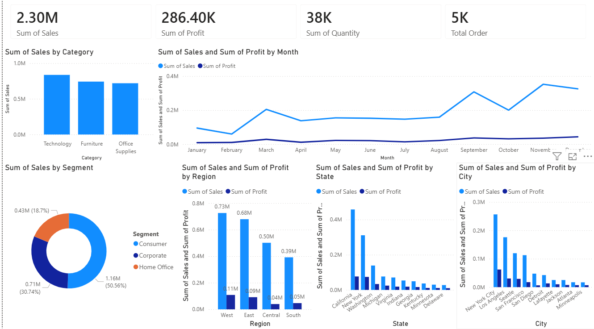
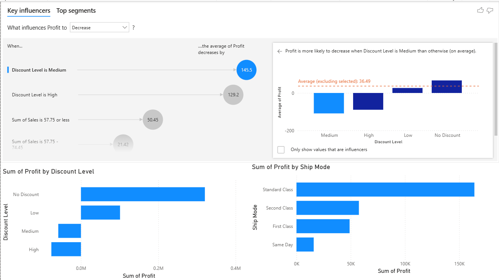
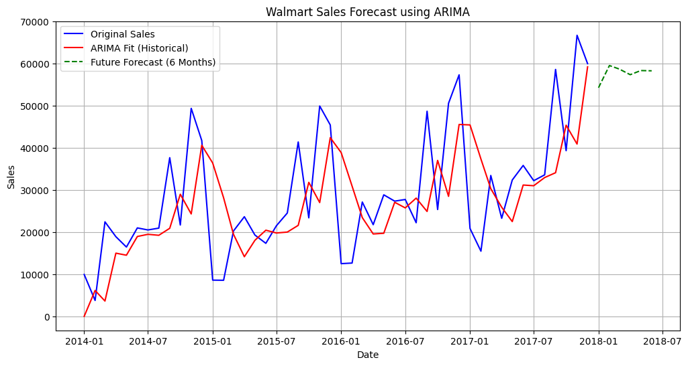

<div align="center">

<!-- Cover Page Preview -->
<!-- To display the cover page: open cover.html in your browser or run the notebook -->

# 🛒 Walmart Sales Analysis & Forecasting

**End-to-end data science project** covering sales analysis, time series forecasting, machine learning prediction, and interactive Power BI dashboards on Walmart order-level data.

[](https://python.org)
[](https://scikit-learn.org)
[](https://powerbi.microsoft.com)
[](https://jupyter.org)


</div>

---

## 📌 Project Overview

This project analyzes Walmart's transactional sales data to uncover business insights, identify sales trends over time, and build a predictive model for order-level sales. The project follows a complete data science pipeline from raw data to business-ready dashboards.

---

## 📊 Dataset

**Source:** Walmart Superstore Transactional Data  
**Records:** 9,994 orders  
**Features:** 21 columns including:

| Category | Features |
|----------|----------|
| Order Info | Order ID, Order Date, Ship Date, Ship Mode |
| Customer | Customer ID, Name, Segment |
| Location | City, State, Region, Country |
| Product | Product ID, Name, Category, Sub-Category |
| Financials | Sales, Quantity, Discount, Profit |

---

## 🔍 Exploratory Data Analysis (EDA)

- Sales distribution across regions, segments, and categories
- Top performing products and sub-categories
- Profitability analysis by discount levels
- Shipping mode performance and delivery duration trends
- Customer segmentation insights

---

## 📈 Power BI Dashboard

Interactive dashboard covering:

- 📦 Sales by Category & Sub-Category
- 🗺 Regional Sales Map
- 📅 Monthly Sales Trend
- 💰 Profit vs Discount Analysis
- 🚚 Shipping Mode Performance
- 👥 Customer Segment Breakdown

### 📸 Dashboard Preview



### 📸 Influencing Factors



---

## 💡 Key Business Insights

> Derived from the Power BI dashboard analysis.

### 🏆 Top Performing Category & Segment

| Dimension | Leader | Total Sales |
|-----------|--------|-------------|
| Product Category | Technology | $836,154 |
| Customer Segment | Consumer | $1,161,401 |

---

### 📍 Top Performing Locations

**By Region**

| Region | Sales | Profit |
|--------|-------|--------|
| 🥇 West | $725,457 | $108,418 |

**By State**

| State | Sales | Profit |
|-------|-------|--------|
| 🥇 California | $457,687 | $76,381 |

**By City**

| City | Sales | Profit |
|------|-------|--------|
| 🥇 New York City | $256,368 | $62,036 |

---
## 🚨 Outlier Detection & Treatment

Used **IQR (Interquartile Range)** method across key numerical columns:

| Column | Outliers Found | Treatment |
|--------|---------------|-----------|
| Sales | 11.7% (1,167 rows) | Cap upper bound only (no negative sales) |
| Profit | 18.8% (1,881 rows) | Cap using 3×IQR (wider, fairer bounds) |
| Quantity | 1.7% (170 rows) | Skipped — values are naturally valid (1–14) |
| Discount | 8.6% (856 rows) | Skipped — domain knowledge (0–1 range is valid) |

> ✅ No rows were deleted — Winsorization (capping) was used to preserve all 9,994 records.

---

## ⏳ Time Series Analysis — ARIMA Forecasting

Sales data was aggregated monthly and modeled using **ARIMA** to capture historical trends and generate a forward-looking forecast.

**What was done:**
- Monthly and yearly sales trend decomposition
- Seasonality detection across order months
- Peak sales period identification (Q4 spikes visible across all years)
- 6-month future sales forecast beyond the historical data window

**Model:** ARIMA (Auto-Regressive Integrated Moving Average)  
**Historical Range:** January 2014 – January 2018  
**Forecast Horizon:** 6 months (up to July 2018)

### 📈 ARIMA Forecast Chart



> The red line shows the ARIMA model fit on historical data, while the green dashed line projects the next 6 months of expected sales. The model captures the overall upward trend and seasonal fluctuations effectively.

---

## 🤖 Machine Learning — Random Forest Regressor

**Target Variable:** `Sales`

**Key Decisions:**
- Nominal columns → One-Hot encoded (`Segment`, `Region`, `Category`,`Ship Mode`)
- High-cardinality ID columns dropped (`Order ID`, `Customer ID`, `Product ID`, etc.)

**Model Configuration:**
```python
RandomForestRegressor(
    n_estimators=200,
    min_samples_split=5,
    min_samples_leaf=2,
    max_features='sqrt',
    random_state=42,
    n_jobs=-1
)
```

**Evaluation Metrics:**

| Metric | Score |
|--------|-------|
| MAE | 54.1592 |
| RMSE | 77.1283 |
| R² | 0.7906 |

---

```python
xgb = XGBRegressor(n_estimators=200,
learning_rate=0.1,
max_depth=6)
```

**Evaluation Metrics:**

| Metric | Score |
|--------|-------|
| MAE | 36.0403 |
| RMSE | 65.9842 |
| R² | 0.8468 |

---

## 🛠 Tech Stack

| Tool | Purpose |
|------|---------|
| Python 3.10+ | Core programming language |
| Pandas & NumPy | Data manipulation |
| Matplotlib & Seaborn | Data visualization |
| Scikit-learn | Machine learning |
| Power BI | Business dashboard |
| Jupyter Notebook | Development environment |

---

## 🗂 Project Structure

```
walmart-sales-analysis/
│── Walmart Sales Analysis.pptx  # Presentation
├── walmart_sales_Final.ipynb    # Main notebook (EDA + ML + Time Series)
├── README.md                    # Project documentation
├── 
├── data/
│   └── walmart_sales.csv        # Dataset
|       Ready for Visualization.csv   # Data after preprocessing to use in Visualization       
│
└── powerbi/
    └── walmart_dashboard.pbix   # Power BI dashboard file
```

---

## 🔄 Project Pipeline

```
Raw Data
   ↓
Exploratory Data Analysis (EDA)
   ↓
Outlier Detection & Treatment (IQR)
   ↓
Feature Engineering & Encoding
   ↓
Time Series Analysis & ARIMA Forecasting (6-Month Horizon)
   ↓
Random Forest Regressor (Sales Prediction)
   ↓
Xgboost (Sales Prediction)
   ↓
Power BI Dashboard (Business Insights)
```

---

## ▶️ How to Run

```bash
# 1. Clone the repo
git clone https://github.com/your-username/walmart-sales-analysis.git
cd walmart-sales-analysis

# 2. Install dependencies
pip install pandas numpy matplotlib seaborn scikit-learn jupyter

# 3. Launch notebook
jupyter notebook walmart_sales_Final.ipynb

```


<div align="center">
 
 **Walmart Sales Analysis & Forecasting 2026**  

</div>
